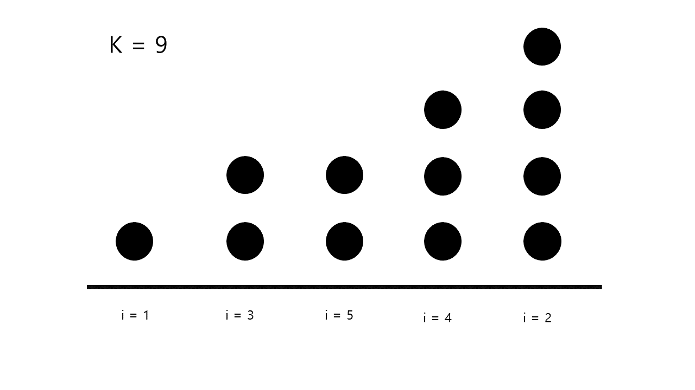
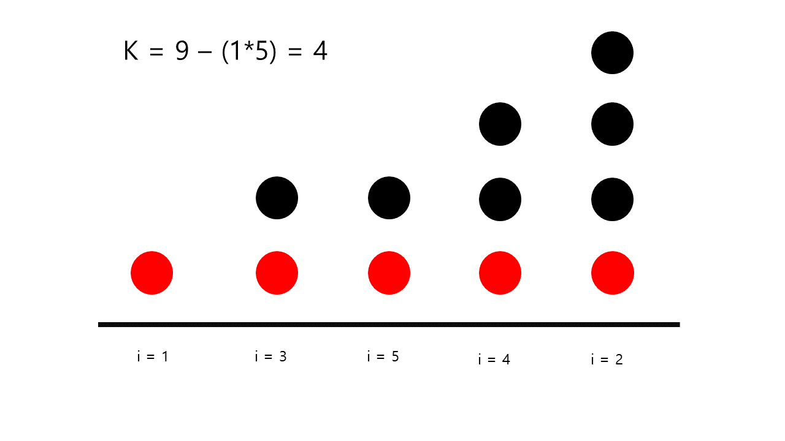
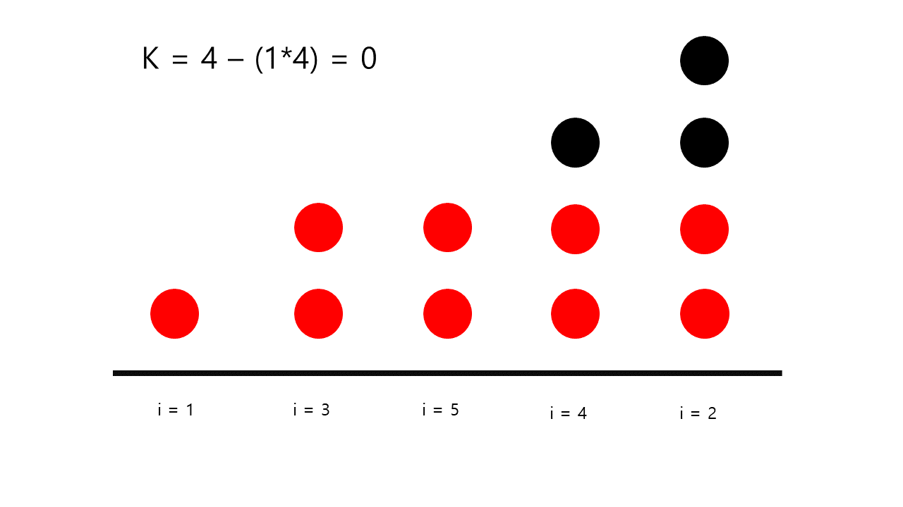
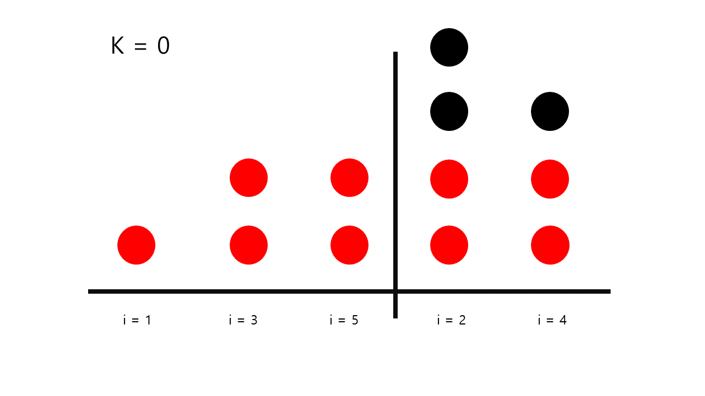

### 무지의 먹방 라이브
link : [무지의 먹방 라이브 kakao 2019](https://programmers.co.kr/learn/courses/30/lessons/42891)

-----------------------------------

1차적으로 연결 리스트를 사용해 0이 되는 원소를 제외해가며

차례로 순회하는 방법을 사용했다.

로직엔 문제가 없고 O(k)의 복잡도지만, 효율성 테스트 제한에서

k가 매우 큰 수이기 때문에 지금처럼 k 횟수대로 순회하면 너무 오랜 시간이 걸렸다.

다른 방법을 찾아야 했다.

------------------------------------

몇 번의 시행착오 후 아예 다른 방법을 구상했다.

k를 기준으로 순회를 도는 것이 문제라면

food_times를 기준으로 순회를 도는 방법을 찾으면 되겠다고 생각했다.

그리고 최대한 k의 크기를 빠르게 줄일 수 있도록 했다.

문제조건이 다음과 같다고 가정하자.

    food_times = [1,4,2,3,2]
    k = 9

우선 배열의 인덱스 값과 시간을 시간순으로 정렬한다.

그리고 순회를 돌게되면, 작은 시간 값 부터 나오게 된다.

만약 현재 k 가 (시간값 t * 남은음식 수 n_remain) 보다 크다면, 

n_remain 크기의 순회를 t 번 돌 수 있다는 뜻이다.

그렇다면 이 값을 한번에 제할 수 있다.

이 때 더이상 시간값 t인 음식(열)은 존재하지 않는다.

때문에 남은음식 수 n_remain에 -1을 해준다.

2번 째 순회에서도 똑같은 일이 일어나지만, 이미 첫 순회에서

t = 1 일때의 경우를 빼줬으므로 시간 값 t는 이전 t와의 차이이다.

여기서는 t = 2-1 = 1 이다.

3번째 순회 때는, t가 더 커지지 않았으므로, k에는 변화가 없고

최대 남은 음식 수 값만 -1 해준다

이후부터는 k가 (n_remain * t) 보다 작다.

즉 이때부터는 더이상 어떤 음식을 다 먹는 일이 생기지 않는다.

그래서 더이상 순회를 돌지 않고, 남은 배열을 다시 index 순서대로 정렬한다.

n_remain의 크기가 변화하지 않으므로, 남은 k를 전부 고려할 필요가 없고

k를 n_remain으로 나눈 나머지만큼만 이동하면 된다.

이 경우 k가 0이므로 나머지도 0 % 2 = 0 이다.

즉 나머지 리스트의 0번째 값의 원래 index인 2가 최종 답안이다.